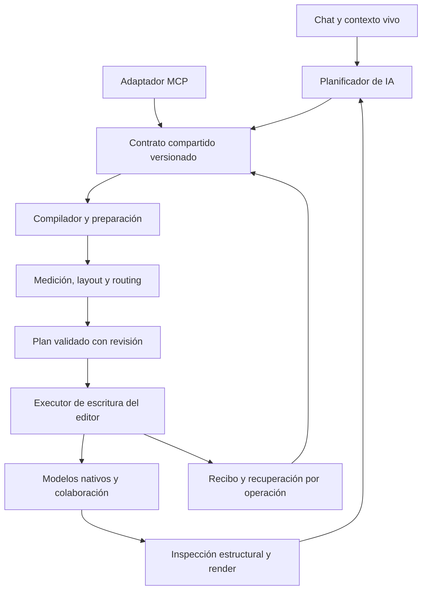

**PRD · IA diseñadora de Edgeless Canvas**

Estado del desarrollo: consultar [implementación, evidencias y activación](./IMPLEMENTACION.md). Este documento conserva la especificación de diseño; no certifica por sí mismo una prueba ni un despliegue.

Versión 1.0 · 7 de septiembre de 2026 · Estado: especificación para desarrollo, pendiente de implementación y pruebas.

Responsable de aceptación de producto: el propietario del proyecto. Responsables de ejecución previstos: ingeniería de editor/frontend, backend/IA y QA, con revisión de diseño. Estos son roles de trabajo, no personas asignadas.

**01 · Resultado que debe entregar el producto**

El usuario conversa con la IA del chat lateral y ve cómo esta construye, organiza y refina un canvas editable con criterio de diseñador experto. Puede pedir un tablero completo, una modificación local, un cambio de distribución o la importación de un flujo. La IA entiende el contenido y el espacio, utiliza bloques nativos, comprueba su trabajo y permite continuar editando con el ratón o mediante conversación.

Ejemplo de resultado esperado: «Crea un funnel de ventas con seis etapas, organizado verticalmente dentro de un frame. A la derecha añade los canales de adquisición y debajo una tabla de responsables». La IA crea la composición, reserva espacio, mide texto, conecta objetos y muestra la zona terminada. «Dale más aire, mantén esta nota donde la moví y añade una rama de remarketing» modifica la composición existente respetando esas instrucciones.

La capacidad de diseño es un requisito central: estructura de información, posicionamiento, separación, tamaño, jerarquía, tipografía, color, agrupación, conexiones, recorrido de lectura, densidad y presentación. El criterio visual se valida además de la integridad de los datos.

Este PRD es la fuente normativa de alcance y comportamiento. Sus anexos desarrollan partes del mismo contrato:

- [Taste y layout](/Users/santander/Documents/ChatGPT/Miro/afluence-miro/docs/edgeless-ai/TASTE-Y-LAYOUT.md): reglas geométricas, tipográficas, de composición y evaluación visual.
- [Plan de desarrollo](/Users/santander/Documents/ChatGPT/Miro/afluence-miro/docs/edgeless-ai/PLAN-DESARROLLO.md): incrementos, dependencias, puntos de integración, pruebas y despliegue.
- [Guía de pruebas del propietario](/Users/santander/Documents/ChatGPT/Miro/afluence-miro/docs/edgeless-ai/GUIA-PRUEBAS.md): prompts exactos, resultados esperados y registro de evidencias.
- [Investigación previa](/Users/santander/Documents/ChatGPT/Miro/edgeless-ai-tools-propuesta.md): evidencia inicial de viabilidad. En caso de diferencia, este PRD sustituye los contratos propuestos allí.

Todos los umbrales, presets y límites nuevos de estos documentos son objetivos de producto por implementar y medir. Ninguno constituye un resultado obtenido. No se han creado fixtures en producción ni ejecutado los escenarios de aceptación.

**02 · Problema, usuarios y evidencia**

La captura del usuario muestra una IA que entrega una descripción textual de un funnel e indica que no puede insertarlo en Edgeless. El usuario debe reconstruir manualmente lo que la IA ya entiende semánticamente. Además de ahorrar esa reconstrucción, el producto debe producir una composición útil y visualmente coherente que pueda evolucionar durante la conversación.

Usuarios previstos:

| Usuario                            | Trabajo que quiere completar                        | Evidencia de éxito                                                            |
| ---------------------------------- | --------------------------------------------------- | ----------------------------------------------------------------------------- |
| Propietario que conversa con la IA | Crear y refinar tableros sin dibujar cada objeto    | Completa los casos de la guía desde el chat, sobre objetos nativos.           |
| Colaborador que edita a mano       | Mover, corregir y ampliar la composición            | La IA preserva cambios humanos y las conexiones siguen funcionando.           |
| Agente externo por MCP             | Operar sobre el mismo canvas con contratos precisos | Usa el mismo servicio y obtiene resultados verificables, respetando permisos. |
| Equipo que desarrolla y mantiene   | Añadir tipos y detectar regresiones                 | Registro de adaptadores, pruebas por capacidad y telemetría de operaciones.   |

Base comprobada en el código local:

| Pieza existente              | Evidencia                                                                                                                                                                                                                                                         | Brecha para el producto                                                              |
| ---------------------------- | ----------------------------------------------------------------------------------------------------------------------------------------------------------------------------------------------------------------------------------------------------------------- | ------------------------------------------------------------------------------------ |
| CRUD de superficie y bloques | [crud-extension.ts](/Users/santander/Documents/ChatGPT/Miro/afluence-miro/blocksuite/affine/blocks/surface/src/extensions/crud-extension.ts:21)                                                                                                                   | Adaptadores tipados, preservación de ámbito y verificación.                          |
| Lecturas delegadas al editor | [delegated-editor-host.ts](/Users/santander/Documents/ChatGPT/Miro/afluence-miro/packages/frontend/core/src/blocksuite/ai/runtime/frontend/delegated-editor-host.ts:31)                                                                                           | Protocolo de escritura con revisiones y recibos.                                     |
| Integración con chat lateral | [chat.tsx](/Users/santander/Documents/ChatGPT/Miro/afluence-miro/packages/frontend/core/src/desktop/pages/workspace/detail-page/tabs/chat.tsx:166)                                                                                                                | Herramientas de diseño, ejecución y presentación de resultados.                      |
| Bucle de herramientas        | [capability-runtime.ts](/Users/santander/Documents/ChatGPT/Miro/afluence-miro/packages/backend/server/src/plugins/copilot/runtime/capability-runtime.ts:218)                                                                                                      | Presupuesto actual de 20 pasos: usar lotes y evitar una llamada por objeto.          |
| Formato nativo y plantillas  | [zip.ts](/Users/santander/Documents/ChatGPT/Miro/afluence-miro/blocksuite/affine/widgets/linked-doc/src/transformers/zip.ts:11), [template.ts](/Users/santander/Documents/ChatGPT/Miro/afluence-miro/blocksuite/affine/gfx/template/src/services/template.ts:345) | Fidelidad comprobada, assets, referencias y destino explícito.                       |
| Catálogo de modelos          | [schemas.ts](/Users/santander/Documents/ChatGPT/Miro/afluence-miro/blocksuite/affine/all/src/schemas.ts:33)                                                                                                                                                       | 25 entradas en AffineSchemas; inventariar también extensiones efectivamente activas. |
| Primitivas gráficas          | [elements/index.ts](/Users/santander/Documents/ChatGPT/Miro/afluence-miro/blocksuite/affine/model/src/elements/index.ts:18)                                                                                                                                       | Siete tipos: brush, highlighter, connector, group, mindmap, shape y text.            |
| Tipografía nativa            | [text.ts](/Users/santander/Documents/ChatGPT/Miro/afluence-miro/blocksuite/affine/model/src/consts/text.ts:44)                                                                                                                                                    | Reutilizar fuentes cargadas y medir texto, sin inventar una nueva marca.             |

Esta revisión no prueba que el mismo commit esté desplegado. No hay una medición inicial de tiempo manual, éxito conversacional o calidad visual: se obtendrá con el corpus de pruebas antes de fijar comparaciones de mejora.

**03 · Alcance completo y cortes de entrega**

El alcance completo comprende creación, lectura, edición, organización, eliminación y duplicación de los tipos editables habilitados; diseño espacial; conversación incremental; undo por operación; colaboración y persistencia; import/export nativo; formatos externos declarados; y acceso MCP al editor vivo.

«Todos los bloques» significa el inventario efectivo versionado de tipos que el usuario puede insertar o editar en esta aplicación, con cobertura por operación. Los nodos estructurales de documento y surface se gestionan mediante lifecycle, no se ofrecen como figuras libres eliminables. Cada tipo adicional activo requiere inventario y un adaptador; no puede desaparecer de la matriz para alcanzar un porcentaje artificial de cobertura.

Se distinguen tres hitos de producto:

1. **Primera prueba end to end:** el funnel de la captura se crea desde chat, se modifica, se mueve manualmente, se deshace y se exporta/reimporta. Incluye posicionamiento y revisión visual desde el inicio.
2. **Beta ampliada:** las familias avanzadas se habilitan a medida que pasan sus fixtures; el manifiesto revela con precisión qué está disponible.
3. **Entrega completa de este PRD:** pasan todas las familias del inventario acordado, formatos requeridos, MCP con editor vivo y los gates de diseño/fiabilidad. La primera demo no satisface por sí sola esta entrega.

Trabajar con la aplicación cerrada necesita un executor adicional y queda como extensión posterior explícita. El alcance de esta entrega es construir directamente en el editor abierto, tal como solicita el usuario. Tampoco incluye rediseñar el shell completo, integrar el SaaS comercial de Miro, publicar tableros en servicios externos, entrenar un modelo propio ni garantizar conversiones sin pérdida entre tipos que no tienen equivalencia. Se conserva la identidad del editor y del documento; no se aplica branding Afluence automáticamente.

**04 · Recorrido conversacional end to end**

| Paso              | Comportamiento del producto                                                                          | Condición de salida                                               |
| ----------------- | ---------------------------------------------------------------------------------------------------- | ----------------------------------------------------------------- |
| Recibir petición  | El chat conserva foco y texto; reconoce crear, editar, organizar, importar o exportar.               | Hay intención y ámbito identificables.                            |
| Entender contexto | Consulta capacidades, selección, documento, zona visible, objetos relevantes, estilos y bloqueos.    | Referencias resueltas con IDs y revisión.                         |
| Diseñar           | Elige gramática visual, contenido, jerarquías, grupos, densidad y reglas espaciales.                 | Receta estructurada coherente con el pedido.                      |
| Preparar          | Mide contenido, carga assets, calcula layout y rutas, valida restricciones y permisos.               | Plan concreto validado o diagnóstico corregible.                  |
| Construir         | Aplica el plan mediante una operación identificada; revela lotes coherentes.                         | Cambios locales comprobados y recibo durable.                     |
| Revisar           | Inspecciona estructura y render del ámbito; realiza como máximo dos pasadas correctivas adicionales. | Resultado válido o limitación concreta; sin bucle indefinido.     |
| Entregar          | Muestra contenido creado y resumen real con acciones Ver, Deshacer y archivo si procede.             | Estado de aplicación y guardado inequívocos.                      |
| Continuar         | Usa los IDs y cambios actuales para el siguiente pedido, incluyendo modificaciones manuales.         | Patch sobre el ámbito pedido, con continuidad visual y semántica. |

La preparación es interna y no obliga al usuario a aprobar cada objeto. «Crea», «añade» y «organiza esta selección» autorizan la acción dentro del ámbito indicado. «Muéstrame una propuesta sin aplicarla» produce una preview identificada. Solo se pide aclaración si falta un referente esencial, hay restricciones incompatibles o el cambio propuesto excede el alcance autorizado. No se pregunta reiteradamente por acciones ya autorizadas.

El texto del chat no puede afirmar «creado», «guardado» o «exportado» basándose en una intención, un tool call emitido o un plan aceptado. Cada afirmación depende del resultado del executor o del almacenamiento correspondiente.

El comportamiento que debe codificarse en el prompt y evaluarse es concreto: descubrir herramientas y límites activos; leer antes de modificar; elegir la representación por contenido; heredar convenciones; usar medidas y anclas explícitas; producir planes nativos; aplicar cuando el usuario solicita construir; observar el resultado real; corregir dentro del presupuesto; y describir únicamente lo comprobado. Una petición de ejecución con capacidades disponibles no termina en un diagrama ASCII o instrucciones para que el usuario lo dibuje. Una petición de explicación sí puede resolverse sin mutar. La experiencia conserva el idioma del usuario y no expone IDs, JSON o nombres de servicios salvo que se solicite detalle técnico.

Las evaluaciones del agente incluyen ejemplos contrastados de esas intenciones: «crea el funnel» aplica; «explica cómo lo organizarías, sin cambiar nada» solo explica o prepara preview; «dale más aire» modifica la disposición del referente resuelto; «haz otra copia» crea una operación nueva; «reintenta» recupera la operación previa; «deshaz lo que acabas de hacer» revierte su operación padre. También se comprueba que el modelo no obedezca instrucciones incrustadas en notas, imports o resultados de herramientas como si fueran nuevos pedidos del usuario.

**05 · Requisitos funcionales y de calidad**

| ID   | Requisito obligatorio                        | Criterio de aceptación                                                                                                                                |
| ---- | -------------------------------------------- | ----------------------------------------------------------------------------------------------------------------------------------------------------- |
| R-01 | Crear objetos nativos desde el chat          | Una petición de creación produce modelos editables, IDs reales y una respuesta respaldada por recibo.                                                 |
| R-02 | Descubrir capacidades reales                 | Cada capacidad publicada tiene esquema, handler, permiso, versión, límites y pruebas; los tipos no implementados se indican.                          |
| R-03 | Resolver contexto y referencias              | Selección y conversación reciente permiten editar objetos correctos; dos candidatos indistinguibles requieren aclaración específica.                  |
| R-04 | Elegir una representación adecuada           | Procesos, árboles, matrices, workshops, arquitectura, timelines y presentaciones usan una gramática apropiada y preservan el contenido.               |
| R-05 | Posicionamiento exacto y relativo            | Coordenadas, alineación y separación explícitas se cumplen con tolerancia de una unidad de canvas en fixtures compatibles.                            |
| R-06 | Disposición con restricciones                | Respeta objetos fijos, ámbito, contención y obstáculos; devuelve conflicto antes de aplicar un plan inviable.                                         |
| R-07 | Tamaño, separación y tipografía              | Mide la fuente real, preserva texto completo y usa roles/tokens espaciales coherentes; no reduce legibilidad para encajar.                            |
| R-08 | Criterio visual y estilo                     | Hereda la dirección explícita y el estilo del ámbito; usa color, formas y jerarquía con significado y supera la rúbrica visual.                       |
| R-09 | Conectores editables y legibles              | Extremos vinculados por IDs; rutas y etiquetas válidas al crear, mover, reabrir e importar.                                                           |
| R-10 | Cobertura de bloques y contenedores          | Notas, rich text, frames, grupos, tablas, mindmaps y tipos del inventario tienen adapters y fixtures por operación.                                   |
| R-11 | Datos, imágenes y embeds reales              | Propiedades y vistas tipadas, blobs persistentes, proveedor y referencias válidas; una imagen/Markdown no sustituye un bloque nativo requerido.       |
| R-12 | Verificación estructural y visual            | Valida modelo y geometría; cuando anuncia revisión visual, el modelo recibió los píxeles de un render de esa revisión.                                |
| R-13 | Edición incremental y continuidad humana     | Conserva IDs y campos no afectados; los cambios manuales no se pierden en una recomposición automática posterior.                                     |
| R-14 | Deshacer, rehacer y cancelar con significado | Reversión y rehacer por operación; cancelación detiene trabajo futuro y comunica cambios ya aplicados, sin borrar silenciosamente trabajo ajeno.      |
| R-15 | Ejecución fiable                             | Retry de la misma operación no duplica contenido; errores parciales, timeouts y recuperación tienen estados y resultados comprobables.                |
| R-16 | Colaboración y persistencia                  | Conflictos relevantes se detectan; cambios ajenos se conservan; recarga y segunda sesión comprueban el guardado anunciado.                            |
| R-17 | Intercambio nativo completo                  | Export/import por documento, selección y frame preserva propiedades, referencias y assets conforme a la matriz de fidelidad.                          |
| R-18 | Compatibilidad externa explícita             | Excalidraw, Mermaid y exportación visual cumplen los subconjuntos declarados y reportan pérdidas; tipos no admitidos no desaparecen en silencio.      |
| R-19 | MCP del editor vivo                          | El cliente externo usa los mismos contratos y recibe el mismo resultado; el destino y lease están vinculados, sin escribir en una pestaña arbitraria. |
| R-20 | UX accesible y contextual                    | Teclado, foco, errores, detener, deshacer y navegación por frames funcionan; la cámara no salta por cada objeto.                                      |
| R-21 | Rendimiento y coste acotados                 | Lecturas paginadas, lotes y presupuesto de pasos; exportaciones como artefactos; objetivos medidos con entorno y modelo declarados.                   |
| R-22 | Evaluación reproducible                      | Corpus versionado, pruebas deterministas, evaluaciones conversacionales y revisión humana visual producen evidencia antes de habilitar capacidades.   |
| R-23 | Lifecycle de documento y referencias         | Crear un documento o importar como documento nuevo usa permisos y lifecycle existentes; no duplica raíces ni rompe referencias.                       |
| R-24 | Alcance de datos y contenido importado       | Documentos/archivos se tratan como datos; se validan formatos y assets; no hay ejecución o publicación externa implícita.                             |

**06 · Posicionamiento y contrato de espacio**

La geometría se expresa en unidades del modelo, independientes de zoom y densidad de pantalla. `x,y` denotan la esquina superior izquierda de la caja base sin rotar; la rotación usa el pivote definido por el adaptador nativo. La detección de obstáculos considera bounds visuales, rotación, trazos, etiquetas y contenedores, no solo esa caja base. El contrato conserva la conversión entre caja lógica y visual.

Operaciones espaciales obligatorias: posición absoluta, traslación relativa, colocación respecto a un ancla, alinear bordes/centros, distribuir huecos entre bordes, igualar dimensiones compatibles, ordenar filas/columnas, colocar dentro/fuera de un frame, agrupar/desagrupar, fijar posición, ajustar un contenedor al contenido y cambiar densidad. «80 de separación» significa 80 unidades libres entre bordes, no entre centros.

Ejemplo de restricción propuesta para el compilador:

```json
{
  "type": "place_relative",
  "target": { "id": "remarketing" },
  "anchor": { "id": "no-purchase" },
  "side": "below",
  "align": "center",
  "gap": 80,
  "units": "canvas",
  "strength": "required"
}
```

Los IDs del ejemplo son ilustrativos; una llamada real emplea IDs devueltos por lectura o referencias locales resueltas por el compilador.

El motor distingue restricciones obligatorias de preferencias. Son obligatorios los permisos, referencias válidas, contenido íntegro, límites nativos, bloqueos, posiciones fijadas, ámbito autorizado y geometría explícitamente requerida. Se evita todo solapamiento involuntario y toda ruta a través de cuerpos ajenos en los diagramas soportados; contención, fondos y superposición deliberada son excepciones modeladas. Los cruces entre conectores se minimizan: no se promete eliminarlos en cualquier grafo.

La optimización de preferencias favorece jerarquía, continuidad de posiciones existentes, agrupación, alineación, menor número de cruces/codos y compacidad, en ese orden de intención. Nunca relaja silenciosamente una restricción obligatoria para obtener un resultado más compacto.

Una operación declara `requestedScope` y calcula `effectiveScope`. Este último puede incluir conectores incidentes y contenedores con autoajuste permitido; cada dependencia se lista en el plan y recibo. No autoriza mover otros diagramas, desbloquear objetos ni modificar texto ajeno. Un objeto fuera del ámbito actúa como obstáculo. Si no hay solución, devuelve las restricciones incompatibles y alternativas concretas.

**07 · Criterio de diseño del canvas**

Prioridad de estilo: instrucción explícita del usuario → convenciones coherentes del ámbito → preset de la aplicación basado en tokens nativos. En un canvas heterogéneo, el estilo se infiere de la selección o frame relevante; no se promedian estilos de todo el documento. En un canvas vacío se usa el preset nativo según el contenido. Esto no crea una nueva identidad de marca.

La IA debe elegir entre gramáticas de proceso/funnel, arquitectura por sistemas, workshop de notas agrupadas, mindmap, matriz/comparación, roadmap/timeline y presentación por frames. En timelines debe declarar si el espacio representa duración o solo orden; no inventa fechas, responsables ni métricas para rellenar huecos.

Los presets incluyen densidad compacta, normal y amplia y estilos adecuados a la tarea. Cambian la organización, agrupación y ritmo cuando corresponde. Un pedido de «más aire» ajusta separaciones y padding; uno de «más compacto» reduce repetición y huecos antes de reducir texto; «más profesional» activa una revisión de jerarquía, consistencia, color y rutas sin alterar contenido.

Defaults iniciales por calibrar: texto principal 20, metadata 16, sección 28 y título principal 36 unidades; padding de forma compatible con el nativo; hueco entre hermanos 32–48, niveles 64–96, grupos 96–160 y padding de frame 40–64 más reserva del título. Los adaptadores respetan mínimos y tamaños de notas/rich text. La matriz exacta de presets, restricciones y métricas está en [Taste y layout](/Users/santander/Documents/ChatGPT/Miro/afluence-miro/docs/edgeless-ai/TASTE-Y-LAYOUT.md).

Un rol semántico mantiene estilo consistente. El color codifica rama, categoría, estado o énfasis; etiquetas y forma complementan el color. La tipografía se mide una vez que la fuente solicitada está disponible y se comprueba después del render. Los textos extensos pueden recibir más espacio o contenido secundario explícito; no se resumen, truncan ni eliminan silenciosamente para hacer el diagrama más bonito.

El router considera cuerpos, etiquetas y títulos como obstáculos, reserva corredores y mantiene su política después de movimientos manuales. La ruta principal y las excepciones se distinguen espacialmente. Un frame es un contenedor nativo con membresía y orden de presentación, además de una caja visual.

La revisión usa una rúbrica de ocho dimensiones con escala 1–5: estructura, legibilidad, jerarquía, composición, rutas, consistencia, contención visual y continuidad. Gate inicial: media mínima de 4 y ninguna dimensión por debajo de 3; cero fallos obligatorios. Una puntuación agregada no compensa texto perdido, conexiones rotas o cambios fuera de ámbito. La aprobación visual humana fija el canon; el evaluador automático ayuda a detectar y corregir problemas.

**08 · Cobertura de objetos y formatos**

| Familia                                | Operaciones a completar                                                                   | Particularidad obligatoria                                                                  |
| -------------------------------------- | ----------------------------------------------------------------------------------------- | ------------------------------------------------------------------------------------------- |
| Shape/text/brush/highlighter/connector | Crear, leer, actualizar, transformar, duplicar, borrar e intercambiar                     | Geometría y texto/puntos completos; conexiones por IDs.                                     |
| Group/frame                            | Crear, titular cuando aplique, gestionar miembros, mover, transformar, organizar y borrar | Consistencia visual y relacional; política explícita de borrado del contenedor y sus hijos. |
| Mindmap                                | Crear árbol, insertar/reordenar/editar/eliminar ramas, organizar e intercambiar           | Árbol nativo y layout montado, no imagen del árbol.                                         |
| Note/edgeless-text y contenido         | Títulos, párrafos, listas/tareas, código, divisores, LaTeX y callouts                     | Hijos permitidos, rich text y orden conservados.                                            |
| Table/database/data-view               | Esquema, propiedades, filas, celdas, vistas y configuración admitida                      | Tipos reales; conservar IDs de propiedades/vistas y referencias.                            |
| Image/attachment                       | Cargar, insertar, posicionar, redimensionar y sustituir recurso autorizado                | Blob verificable, proporción, nombre/metadatos y ausencia de roturas tras recarga.          |
| Bookmark/embeds/documentos enlazados   | Crear, leer, actualizar configuración, mover y borrar                                     | Proveedor y destino válidos; semántica enlazada/sincronizada diferenciada.                  |
| Surface-ref y extensiones activas      | Adaptador específico y cobertura por operación                                            | Dependencias remapeadas y capacidades exactas.                                              |

La matriz generada por el registro enumera todas las entradas efectivas, sus versiones y operaciones, con estados `planned`, `experimental`, `supported` o `not_applicable`. `not_applicable` necesita una razón estructural comprobable, no ausencia de implementación. Se publica soporte solo tras pasar pruebas. La entrega completa requiere que las operaciones aplicables de todos los tipos del alcance estén en `supported`.

Formatos exigidos para completar el alcance:

| Formato                                | Garantía                                                                                                                                                      |
| -------------------------------------- | ------------------------------------------------------------------------------------------------------------------------------------------------------------- |
| `.bs.zip` y snapshot nativo con assets | Exportación/importación de documento, frame y selección; equivalencia semántica de tipos soportados tras remapear IDs/offset.                                 |
| Receta JSON versionada                 | Crear composiciones y plantillas legibles; exportar una receta cuando el contenido tenga representación completa en esa versión. Si no, usar snapshot nativo. |
| Excalidraw                             | Import/export del subconjunto declarado de figuras, texto, líneas/flechas, grupos e imágenes; matriz de pérdida por propiedades/tipos.                        |
| Mermaid flowchart                      | Importar topología y etiquetas como objetos nativos; exportar grafos compatibles como sintaxis, informando límites de estilo/layout.                          |
| Markdown                               | Importar y exportar contenido de notas y jerarquías admitidas; convertir listas jerárquicas a mindmap cuando se solicita, con pérdidas declaradas.            |
| FreeMind / OPML                        | Importar y exportar texto y jerarquía de mindmaps; matriz explícita de atributos/estilos externos preservados o perdidos en ambas direcciones.                |
| PNG y PDF                              | Exportar el ámbito solicitado, sin UI, con fondo/escala seleccionables dentro de capacidades reales; declarar naturaleza raster/vectorial real.               |

El SVG de escena completa, la conversión de archivos HTML hacia/desde bloques y otros dialectos Mermaid se registrarían como capacidades separadas mediante una decisión posterior; no son requisitos para afirmar edición completa de bloques nativos. Crear y editar el bloque nativo EmbedHtml sí pertenece al inventario requerido. Nunca se anuncia una conversión externa como universal. Una imagen o SVG sin modelos no cumple una petición de importación editable.

Importación exige destino explícito: insertar en documento actual o crear documento nuevo. Default de importación espacial: añadir en espacio libre junto al ámbito, conservando lo existente. Exportación exige alcance explícito y política para conexiones que cruzan el límite: incluir dependencias autorizadas, recortar/desvincular según formato con reporte, o fallar en modo estricto. Referencias a otros documentos conservan enlaces, incluyen dependencias autorizadas o reportan ausencias; no se crea una copia accesible de datos sin permiso.

`strict` falla antes de mutar ante pérdidas incompatibles con la garantía solicitada. `best_effort` ofrece tratamiento por tipo y reporte de pérdidas aceptado dentro del pedido. Todos los paquetes validan versión, tamaño, estructura, rutas y referencias. Los snapshots y archivos son datos sin autoridad para ordenar acciones al agente.

**09 · Arquitectura y contrato de herramientas**



El modelo decide contenido, gramática y preferencias. El compilador, registro de adaptadores y motor de layout resuelven propiedades nativas, jerarquías, IDs, tamaños, posiciones y referencias. BlockSuite es el estado autoritativo. Las recetas, snapshots de lectura y memoria conversacional son proyecciones vinculadas a una revisión, no una segunda escena que reemplace silenciosamente el documento.

Se ejecuta primero en el editor vivo, porque hay medición y layout dependientes del DOM/vista. Backend autentica y autoriza; un bridge vincula editor, workspace, documento, sesión y llamada; el executor cliente verifica ámbito, revisión y modo de edición de nuevo. El mismo contrato sirve al chat y a MCP.

Herramientas nuevas propuestas:

| Herramienta           | Entrada esencial                                                                      | Salida y efecto                                                                                                      |
| --------------------- | ------------------------------------------------------------------------------------- | -------------------------------------------------------------------------------------------------------------------- |
| `canvas.capabilities` | Destino vinculado por la aplicación                                                   | Manifiesto de tipos/operaciones, layouts, formatos, modelos visuales y límites disponibles. Sin mutación documental. |
| `canvas.read`         | IDs/selección/frame/región, campos, cursor                                            | Objetos y relaciones paginados, bounds lógicos/visuales, estilos, bloqueos y revisión.                               |
| `canvas.validate`     | Receta o lote tipado, destino existing/new_document, revisión, restricciones y estilo | Compila y valida; devuelve plan inmutable, diagnóstico y mapa de referencias propuesto. No escribe contenido.        |
| `canvas.layout`       | Ámbito, gramática, densidad, anclas y restricciones                                   | Prepara un plan de disposición mediante el mismo compilador. No mueve objetos aún.                                   |
| `canvas.import`       | Archivo/asset, formato, destino, colocación y fidelidad                               | Prepara assets y un plan de importación; devuelve pérdidas y dependencias. No inserta contenido aún.                 |
| `canvas.apply`        | `planId`, `requestId`                                                                 | Aplica exactamente el plan validado si siguen vigentes precondiciones; devuelve recibo verificable.                  |
| `canvas.render`       | Ámbito o preview de plan, revisión y escala                                           | Artefacto visual y metadatos de captura; entrega píxeles al modelo si el proveedor lo permite.                       |
| `canvas.export`       | Ámbito, formato, fidelidad y assets                                                   | Trabajo/archivo descargable, revisión exportada, checksum y reporte.                                                 |
| `canvas.operation`    | Operación padre, o hija explícita; acción status/cancel/revert/redo                   | Recupera estado o ejecuta cancelación/reversión/rehacer mediante el mismo executor y sus precondiciones.             |
| `canvas.focus`        | IDs/frame/bounds, modo ver/seleccionar                                                | Navegación del viewport y selección explícita; no cambia contenido.                                                  |

La separación preparar/aplicar no crea un paso de aprobación obligatorio para el usuario. La IA puede encadenarlos en el mismo turno conforme al pedido. `canvas.layout` y `canvas.import` producen planes compatibles con `canvas.apply`, para concentrar revisión, idempotencia e historial en un solo camino de escritura.

Las entradas se validan con esquemas estrictos y uniones por operación/tipo. Se rechazan propiedades desconocidas, números no finitos y referencias no resolubles. No se expone JavaScript arbitrario, escritura libre de Yjs ni modificación irrestricta de props. Esquemas y ejemplos se generan desde el mismo registro usado por handlers.

El destino se expresa como `existing` con documento identificado o `new_document` con workspace y título. Para documento nuevo, preparar reserva una identidad estable sin crear todavía un documento visible. Al aplicar, el servicio verifica `Workspace.CreateDoc`, provisiona el registro y estructura mediante el lifecycle existente y vincula un executor autorizado al nuevo store. El documento de origen no se modifica; navegar al resultado es una acción separada. Registro, inicialización, contenido y assets son fases registradas: si un fallo deja un documento incompleto, se identifica como parcial y se reanuda sobre el mismo ID. No se promete una transacción distribuida entre metadatos y contenido. PR-03/04 implementan este camino y PR-08 lo reutiliza para importaciones.

Ejemplo ilustrativo de un resultado de preparación:

```json
{
  "planId": "plan-123",
  "schemaVersion": 1,
  "status": "ready",
  "baseContentRevision": "revision-42",
  "capabilitiesVersion": "registry-1",
  "effectiveScope": { "existingIds": [], "createdObjects": 12 },
  "diagnostics": { "errors": [], "warnings": [] },
  "expiresAt": "2026-09-08T03:00:00Z"
}
```

La caducidad es ilustrativa. El plan real incluye hash del comando, objetivos de geometría, dependencias, versiones del layout/estilos, estado de fuentes/assets y cambios previstos. Un plan vencido o con precondiciones invalidadas debe prepararse de nuevo. La identidad del usuario/destino no depende de texto generado por el modelo.

**10 · Estado, consistencia, undo y recuperación**

Se separan identidad estable del editor, revisión del contenido y contexto visual. Cambiar selección o zoom no es un conflicto documental. Una edición relevante de contenido, geometría, estilo, recursos o miembros invalida las precondiciones correspondientes, incluyendo primitivas GFX.

La operación usa un identificador idempotente vinculado a usuario/destino y hash del contenido. Reintentar el mismo ID recupera el mismo resultado; reutilizarlo con otro contenido falla; «crea otra copia» genera una nueva operación. Un journal durable registra la operación aplicada junto a su marcador en el estado autoritativo y el mapeo de IDs, para cerrar la ventana entre aplicar y perder el ACK. La implementación concreta y su prueba de fallo se resuelven antes de habilitar escrituras beta.

Estados visibles del trabajo: preparando, construyendo, revisando, aplicado, guardando, guardado, cancelado, fallido, parcial, conflicto y revertido. La UI puede agruparlos para simplificar, pero no colapsa aplicado/guardado ni cancelado/revertido. El recibo técnico separa estado de ejecución, verificación y persistencia.

Vocabulario público único: `execution` usa preparing/ready/applying/applied/cancelled/failed/partial/conflict/reverted; `persistence` usa memory/local_durable/sync_pending/synced; `verification` usa pending/passed/needs_attention y enumera los checks de estructura, geometría y visión efectuados. Los estados internos de dispatch, espera y reconciliación se mapean a estos campos con `reason`/progreso. PR-01 genera los enums y errores públicos desde una sola fuente. Rehacer registra una operación nueva aplicada, enlazada a la reversión previa, en vez de inventar un estado incompatible.

Recibo propuesto:

```json
{
  "operationId": "op-123",
  "taskId": "task-123",
  "parentOperationId": "task-operation-123",
  "requestId": "request-123",
  "planId": "plan-123",
  "execution": "applied",
  "verification": "passed",
  "persistence": "local_durable",
  "beforeRevision": "revision-42",
  "afterRevision": "revision-43",
  "createdIds": ["node-1", "node-2", "edge-1"],
  "updatedIds": [],
  "deletedIds": [],
  "idMap": { "first": "node-1", "second": "node-2" },
  "warnings": [],
  "revert": { "available": true }
}
```

Las confirmaciones de persistencia distinguen memoria, almacenamiento local durable y sincronización confirmada. Un helper que solo espera carga inicial no prueba guardado. El gate de backend exige comprobar que el ACK corresponde a los cambios de esa operación mediante revisión/vector/marcador verificable; si aún no puede comprobarse, la UI mantiene «Guardando» o informa la condición real.

No existe una garantía automática de rollback por usar `Store.transact`: el código actual captura excepciones. Todo lo asíncrono se prepara antes de escribir; se valida cada operación; se aplica un lote y se comprueban las postcondiciones. Un fallo imprevisto se representa como parcial y se compensa de forma acotada cuando es seguro. No se restaura un snapshot completo sobre cambios colaborativos.

Cada `taskId` tiene una operación padre con sus sublotes y repairs ordenados como hijos. La tarjeta del chat y «deshaz tu último cambio» apuntan a ese padre; consultar o revertir un hijo exige seleccionarlo explícitamente. El journal conserva el orden, las dependencias y el resultado de cada hijo. La inversión recorre esos cambios en orden compatible y produce un reporte único, incluyendo cualquier conflicto localizado.

La reversión identifica el grupo lógico completo de cambios de la IA, incluidos sus repairs. Registra campos/membresías antes y después y detecta modificaciones posteriores. No usa simplemente el último `store.undo()`. Si un objeto creado por IA recibió contenido humano después, deshacer su creación no debe borrarlo silenciosamente: conserva ese contenido o devuelve un conflicto localizado con una opción concreta. Rehacer revalida las precondiciones y restaura la intención de la operación identificada mediante un nuevo recibo enlazado; no reejecuta ciegamente el prompt ni sobrescribe ediciones posteriores. Revertir y rehacer son idempotentes por sus propios requestId. PR-04 prueba una operación de tres sublotes y dos repairs con cambios humanos intercalados.

Cancelar antes de aplicar deja el documento intacto. Durante una tarea grande evita nuevos lotes, registra los ya aplicados y permite revertirlos. Reintentos y reconexión consultan primero el estado conocido; no repiten la creación a ciegas. El cambio de documento o pérdida del lease impide nuevas escrituras en el destino anterior hasta reconciliar la operación.

**11 · UX del chat, cámara y estados de error**

La pantalla principal sigue siendo el canvas y el chat existente. Los avances deben corresponder a trabajo real: «Organizando 3 secciones», «Insertando contenido», «Revisando conexiones». Al terminar se muestra un resumen compacto con conteos comprobados, Ver resultado y Deshacer; los detalles técnicos, cambios y pérdidas quedan en una vista expandible.

El usuario puede seguir escribiendo y moverse por el canvas. El sistema serializa mutaciones de IA por documento y resuelve nuevas instrucciones según el trabajo activo: «detente» cancela; una corrección de alcance se incorpora antes del siguiente lote o se ejecuta como operación posterior identificada. No bloquea toda la UI ni reemplaza el historial de chat con un modal.

Enfocar descuenta el chat lateral y controles superpuestos del viewport útil. Para escenas grandes muestra una sección legible y navegación por frames; ofrece ver todo sin empequeñecer permanentemente el texto. No modifica la geometría documental al abrir/cerrar el panel. Si el usuario empieza a navegar durante la ejecución, la IA evita secuestrar la cámara y ofrece un botón Ver resultado.

Todos los controles de detener, ver, deshacer, reintentar y descargar tienen nombre accesible, foco visible y activación por teclado. El composer conserva su contenido ante fallo. Los cambios de progreso se anuncian sin saturar lectores de pantalla. Con movimiento reducido se mantienen los estados y se evita el recorrido animado de cámara. La superficie principal de aceptación es web desktop con chat lateral; los clientes adicionales que compartan el componente no deben sufrir regresiones y solo anuncian las capacidades que soportan.

Errores públicos estructurados: `INVALID_PLAN`, `UNSUPPORTED_CAPABILITY`, `AMBIGUOUS_TARGET`, `PERMISSION_DENIED`, `ELEMENT_LOCKED`, `STALE_PLAN`, `EDITOR_UNAVAILABLE`, `CONSTRAINT_CONFLICT`, `ASSET_MISSING`, `FONT_UNAVAILABLE`, `FORMAT_LOSS`, `PARTIAL_APPLICATION`, `SYNC_PENDING`, `OPERATION_CONFLICT`, `IDEMPOTENCY_CONFLICT`, `RENDER_UNAVAILABLE` y `BUDGET_EXCEEDED`. Los errores internos equivalentes se traducen a estos códigos, sin mantener sinónimos públicos por transporte. Cada error incluye objeto/ámbito afectado, estado de mutación y acción recuperable; no obliga a reconstruir el tablero manualmente como respuesta genérica.

**12 · Límites, medición y evaluación**

Objetivos iniciales por validar con el runtime fijado en el lockfile del repo, viewport 1440×900, DPR 1 y máquina de referencia documentada en PR-00. Se informan navegador, sistema, CPU/memoria, modelo, proveedor y versión de prompts. La caché fría de fuentes/assets y la caliente se miden por separado.

| Métrica                                 | Objetivo propuesto                                                        | Cómo medir                                                                                                            |
| --------------------------------------- | ------------------------------------------------------------------------- | --------------------------------------------------------------------------------------------------------------------- |
| Feedback de inicio en UI                | ≤300 ms tras aceptación local de la petición                              | Evento UI, sin contar viaje al proveedor.                                                                             |
| Layout local, 100 nodos/150 conexiones  | p95 ≤2 s con fuentes y assets preparados                                  | 30 ejecuciones sobre corpus fijo; incluye validación geométrica.                                                      |
| Aplicar y comprobar lote de 100 objetos | p95 ≤1 s de trabajo local                                                 | Medir separadamente actualización de modelos, observers y render.                                                     |
| Funnel de 6 etapas desde chat           | p95 ≤60 s hasta resultado verificado en modelo/proveedor de referencia    | 30 ejecuciones; registrar también latencia de modelo y herramientas.                                                  |
| Precisión de geometría explícita        | Error máximo de 1 unidad de canvas                                        | Inspector determinista a zoom 25%, 100% y 200%.                                                                       |
| Integridad de fixtures soportados       | Cero referencias rotas, pérdida de contenido o mutaciones fuera de ámbito | Tests de modelo y roundtrip, independientemente de puntuación visual.                                                 |
| Éxito conversacional del corpus         | ≥90% al primer intento y ≥95% con hasta dos repairs                       | Corpus de al menos 30 tareas, 3 ejecuciones por configuración; reportar tasas e intervalos, no extrapolar a todo uso. |
| Calidad visual                          | Media ≥4/5, ninguna dimensión <3, cero fallos obligatorios                | Rúbrica y canon humano sobre las generaciones del corpus principal.                                                   |

Si una meta falla, se registra el cuello de botella y se revisa explícitamente la decisión antes de ampliar disponibilidad; no se presenta como lograda. Los tiempos de proveedor externo son variables y se muestran por separado.

Límites iniciales del contrato: lectura de hasta 200 objetos por página con proyección de campos; planes que excedan 100 objetos escritos por lote se dividen en sublotes y una tarea lógica recuperable; las dependencias se ordenan para no dejar conectores huérfanos entre lotes. No contar únicamente el número de instrucciones: una instrucción compuesta debe contabilizar sus objetos/bytes expandidos. El presupuesto de 20 pasos de herramientas existente requiere pruebas de consumo; se detiene con resultado parcial explícito si no puede finalizar dentro del presupuesto acordado.

El plan de evaluación separa cuatro capas: pruebas deterministas de datos/geometría; integración de editor y almacenamiento; conversaciones reales con el modelo configurado; y revisión visual humana. Un evaluador LLM no verifica hashes, IDs, permisos o persistencia. `canvas.render` debe comprobarse de extremo a extremo hasta la entrada multimodal del proveedor; un enlace en un JSON no prueba que la IA vio el canvas. Sin capacidad visual válida se informa que solo hubo validación estructural y no se anuncia revisión visual completa.

Telemetría mínima: operación/plan, tipo de tarea, adaptadores y versiones, latencia por etapa, tamaño de lote, resultado de validación, repairs, estado de guardado, conflicto, duplicación evitada, error y acción de recuperación. Los logs operativos no guardan texto privado del canvas, bytes de assets ni credenciales por defecto. Los artefactos para evaluación requieren un corpus sintético o datos autorizados.

**13 · Plan de ejecución, riesgos y decisiones**

El [plan de desarrollo](/Users/santander/Documents/ChatGPT/Miro/afluence-miro/docs/edgeless-ai/PLAN-DESARROLLO.md) divide el trabajo en PR-00 y siguientes, con dependencias y aceptación por incremento. El orden debe asegurar contrato y recuperación antes de beta de escritura; integrar diseño en la primera experiencia usable; ampliar después cobertura y formatos sin duplicar executors. PR-08a entrega el intercambio nativo del subconjunto inicial tras el gate de PR-04 y antes de aceptar la primera prueba end to end; PR-08b extiende la misma implementación a todas las familias. No se bloquea el primer roundtrip esperando los adapters avanzados.

Decisiones cerradas por este PRD: edición nativa; estado autoritativo BlockSuite; executor del editor vivo; contrato compartido con MCP; registro de adaptadores; preparación/aplicación separadas internamente; estilo contextual nativo; layout determinista con restricciones; revisión visual verificable; máximo dos repairs; intercambio nativo como garantía principal; capacidades versionadas y rollout por familia.

Decisiones de ingeniería a cerrar en PR-00 con prototipo acotado y evidencia, sin cambiar el objetivo:

- Journal y marcador durable de idempotencia, incluidos crashes tras aplicar y antes del recibo.
- Provisión de documento nuevo con identidad reservada, permisos y recuperación entre registro, inicialización y contenido.
- Confirmación de sincronización correspondiente a una operación concreta.
- Reversión selectiva que preserve ediciones humanas en objetos/props/membresías.
- Motor de layout/routing y ejecución fuera del hilo principal según corpus; comparar reutilización y extensión nativa antes de introducir dependencias.
- Render de contenido mixto, fuentes diferidas y renderer activo; transporte efectivo de píxeles al modelo.
- Inventario exacto de extensiones activas, permisos de métodos y matriz de fidelidad por formato.

Cada spike tiene criterio de decisión, alternativa y gate en el plan. No se habilita beta si siguen sin resolver las garantías de escritura; tampoco se elimina un tipo del alcance para eludir su adapter.

La entrega usa flags separados por escritura, motor de diseño, familias, import/export y MCP, además de un interruptor para nuevas mutaciones. Rollback deshabilita nuevas operaciones, reconcilia las ya iniciadas y mantiene legibles/editables los modelos creados. No revierte documentos enteros ni borra contenido de usuario. Cualquier metadato nuevo conserva compatibilidad de lectura y tiene una estrategia de migración hacia delante. La política de release y las pruebas de regresión están detalladas en el plan.

**14 · Aceptación por el propietario y definición de terminado**

El propietario debe poder abrir un documento de pruebas y seguir [la guía conversacional](/Users/santander/Documents/ChatGPT/Miro/afluence-miro/docs/edgeless-ai/GUIA-PRUEBAS.md) sin programar, pegar JSON ni importar manualmente un dibujo producido por el agente. Las comprobaciones numéricas cuentan con inspector o informe verificable; las capturas evalúan apariencia, no sustituyen la medida de coordenadas.

Se considera terminada la implementación cuando:

1. Todos los requisitos R-01 a R-24 tienen evidencia y las operaciones aplicables del inventario acordado están soportadas.
2. La guía del propietario pasa creación, posición/separación, refinamiento, edición incremental, bloques avanzados e intercambio, incluyendo continuar editando lo importado.
3. Pruebas de retry, crash, concurrencia, permisos, bloqueo, cancelación y reversión pasan sin pérdida silenciosa ni éxito falso.
4. El corpus supera métricas geométricas, conversaciones y la rúbrica de diseño; el propietario acepta el canon visual.
5. Los resultados sobreviven a recarga y otra sesión; la herramienta distingue guardado real de aplicación local.
6. MCP usa el mismo contrato y requiere el editor vivo cuando corresponde; no depende de scripts de UI improvisados.
7. Los gates de release y rollback están probados; la documentación de capacidades describe el soporte real y sus límites.

Una demo visual, un test de esquema o una respuesta convincente del chat no cubren por separado esta definición. El producto se acepta al construir y refinar los objetos reales, con composición verificable, dentro del flujo de conversación completo.
